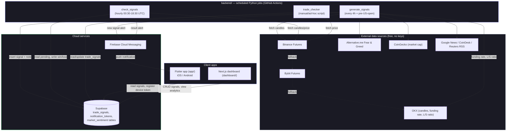

# Dependency Graph

How the pieces of Trade Pilot / Zenviq fit together — data flow between the
Flutter app, dashboard, backend jobs, Supabase, Firebase, and external market
data providers.

## Notes

- **generate_signals** is the core signal-generation engine (top 15 pairs,
  regime-filtered momentum strategy) — see
  [backend/generate_signals/handler.py](backend/generate_signals/handler.py).
- **check_signals** polls pending signals and marks them win/loss/expired
  once TP/SL/expiry is hit.
- **check_signals** (`crypto option trading/src`) is the BTC/ETH options
  equivalent: it closes out open option signals (win/loss/expired +
  `pnl_usd`, `closed_at`, `exit_reason`) and runs right after `run_signal.py`
  in the same workflow (`crypto_option_signals.yml`). Before it existed,
  option signals stayed `pending` forever, so the app's win-rate and P&L
  cards were computed over an empty set. This replaced the earlier NIFTY
  index-options engine (`nifty option trading/`, workflow disabled but kept
  on disk) as the app's Options tab.
- **trade_checker** is a standalone diagnostic script, not on a GitHub
  Actions schedule.
- Both `generate_signals` and `check_signals` push notifications through
  Firebase Cloud Messaging to devices registered in Supabase's
  `notification_tokens` table (written by the Flutter app).
- The dashboard and Flutter app never talk to each other or to the backend
  jobs directly — **Supabase is the single source of truth** all four
  surfaces read/write through.
